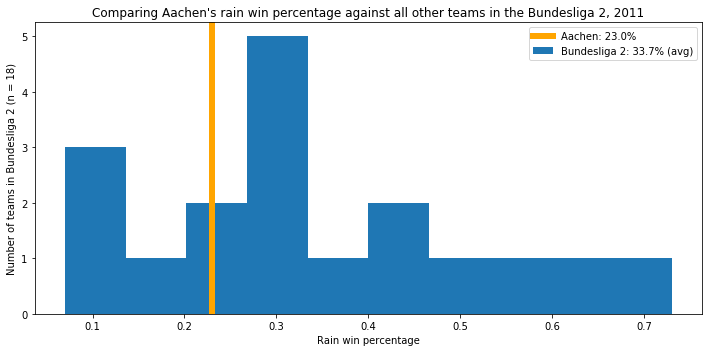
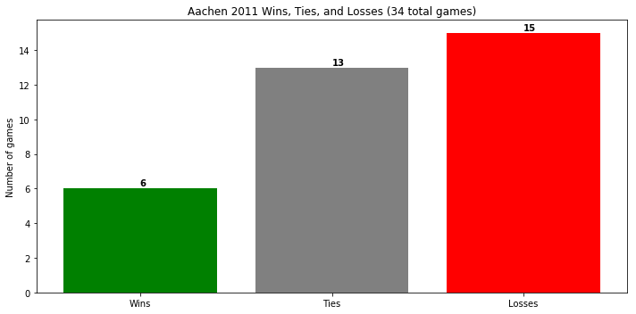
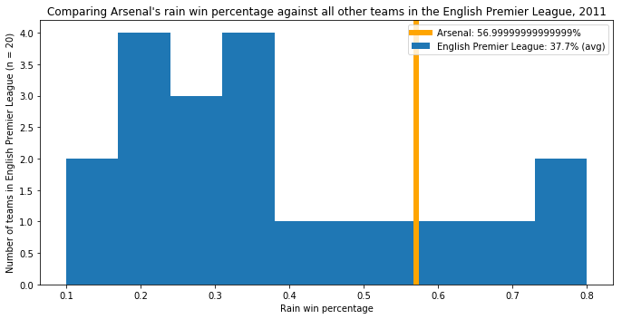
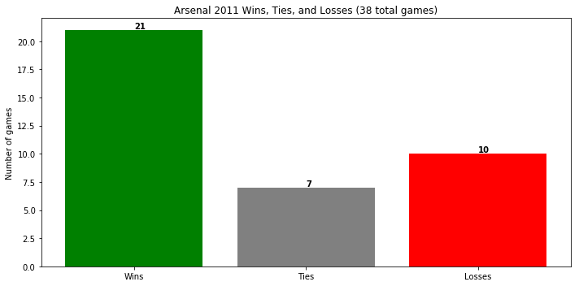
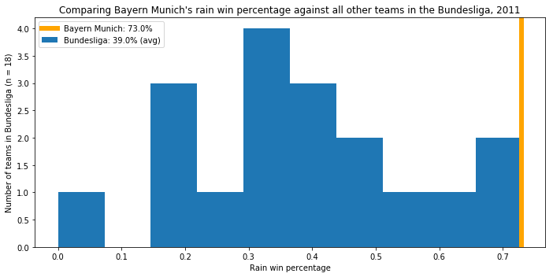
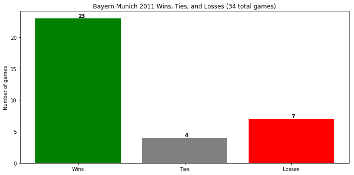

# 2011 Soccer Statistics

Name: Cristian E. Nuno

Date: September 21, 2019

## Overview

Using [data](https://www.kaggle.com/laudanum/footballdelphi) from Kaggle, I created a class that created club specific statistics and visualizationis.

## Load necessary modules


```python
from python.club import Club
```

## Demonstrate OOP using the `Club` class


```python
aachen = Club(name="Aachen")
```


```python
aachen.rain_win_pct_df
```


<div>
<style scoped>
    .dataframe tbody tr th:only-of-type {
        vertical-align: middle;
    }

    .dataframe tbody tr th {
        vertical-align: top;
    }

    .dataframe thead th {
        text-align: right;
    }
</style>
<table border="1" class="dataframe">
  <thead>
    <tr style="text-align: right;">
      <th></th>
      <th>season</th>
      <th>div</th>
      <th>club</th>
      <th>rain_wins</th>
      <th>total_rain_games</th>
      <th>rain_win_pct</th>
    </tr>
  </thead>
  <tbody>
    <tr>
      <th>0</th>
      <td>2011</td>
      <td>D2</td>
      <td>Aachen</td>
      <td>3</td>
      <td>13</td>
      <td>0.23</td>
    </tr>
  </tbody>
</table>
</div>


```python
aachen.plot_rain_win_pct(export=True)
```

    Aachen rain win percentage histogram exported to visuals/ dir





```python
aachen.stats_df
```


<div>
<style scoped>
    .dataframe tbody tr th:only-of-type {
        vertical-align: middle;
    }

    .dataframe tbody tr th {
        vertical-align: top;
    }

    .dataframe thead th {
        text-align: right;
    }
</style>
<table border="1" class="dataframe">
  <thead>
    <tr style="text-align: right;">
      <th></th>
      <th>season</th>
      <th>div</th>
      <th>club</th>
      <th>home_goals_for</th>
      <th>away_goals_for</th>
      <th>goals_for</th>
      <th>home_goals_against</th>
      <th>away_goals_against</th>
      <th>goals_against</th>
      <th>wins</th>
      <th>losses</th>
      <th>ties</th>
      <th>total_games</th>
    </tr>
  </thead>
  <tbody>
    <tr>
      <th>0</th>
      <td>2011</td>
      <td>D2</td>
      <td>Aachen</td>
      <td>15</td>
      <td>15</td>
      <td>30</td>
      <td>24</td>
      <td>23</td>
      <td>47</td>
      <td>6</td>
      <td>15</td>
      <td>13</td>
      <td>34</td>
    </tr>
  </tbody>
</table>
</div>


```python
aachen.plot_stats(export=True)
```

    Aachen season statistics bar chart exported to visuals/ dir





### Since the methods and attributes change with each instantation of `Club`, all of the graphs and data will change based on the value in the `name` parameter


```python
arsenal = Club(name="Arsenal")
```


```python
arsenal.rain_win_pct_df
```


<div>
<style scoped>
    .dataframe tbody tr th:only-of-type {
        vertical-align: middle;
    }

    .dataframe tbody tr th {
        vertical-align: top;
    }

    .dataframe thead th {
        text-align: right;
    }
</style>
<table border="1" class="dataframe">
  <thead>
    <tr style="text-align: right;">
      <th></th>
      <th>season</th>
      <th>div</th>
      <th>club</th>
      <th>rain_wins</th>
      <th>total_rain_games</th>
      <th>rain_win_pct</th>
    </tr>
  </thead>
  <tbody>
    <tr>
      <th>0</th>
      <td>2011</td>
      <td>E0</td>
      <td>Arsenal</td>
      <td>8</td>
      <td>14</td>
      <td>0.57</td>
    </tr>
  </tbody>
</table>
</div>


```python
arsenal.plot_rain_win_pct(export=True)
```

    Arsenal rain win percentage histogram exported to visuals/ dir





```python
arsenal.stats_df
```


<div>
<style scoped>
    .dataframe tbody tr th:only-of-type {
        vertical-align: middle;
    }

    .dataframe tbody tr th {
        vertical-align: top;
    }

    .dataframe thead th {
        text-align: right;
    }
</style>
<table border="1" class="dataframe">
  <thead>
    <tr style="text-align: right;">
      <th></th>
      <th>season</th>
      <th>div</th>
      <th>club</th>
      <th>home_goals_for</th>
      <th>away_goals_for</th>
      <th>goals_for</th>
      <th>home_goals_against</th>
      <th>away_goals_against</th>
      <th>goals_against</th>
      <th>wins</th>
      <th>losses</th>
      <th>ties</th>
      <th>total_games</th>
    </tr>
  </thead>
  <tbody>
    <tr>
      <th>0</th>
      <td>2011</td>
      <td>E0</td>
      <td>Arsenal</td>
      <td>39</td>
      <td>35</td>
      <td>74</td>
      <td>17</td>
      <td>32</td>
      <td>49</td>
      <td>21</td>
      <td>10</td>
      <td>7</td>
      <td>38</td>
    </tr>
  </tbody>
</table>
</div>


```python
arsenal.plot_stats(export=True)
```

    Arsenal season statistics bar chart exported to visuals/ dir





```python
bm = Club(name="Bayern Munich")
```


```python
bm.rain_win_pct_df
```


<div>
<style scoped>
    .dataframe tbody tr th:only-of-type {
        vertical-align: middle;
    }

    .dataframe tbody tr th {
        vertical-align: top;
    }

    .dataframe thead th {
        text-align: right;
    }
</style>
<table border="1" class="dataframe">
  <thead>
    <tr style="text-align: right;">
      <th></th>
      <th>season</th>
      <th>div</th>
      <th>club</th>
      <th>rain_wins</th>
      <th>total_rain_games</th>
      <th>rain_win_pct</th>
    </tr>
  </thead>
  <tbody>
    <tr>
      <th>0</th>
      <td>2011</td>
      <td>D1</td>
      <td>Bayern Munich</td>
      <td>8</td>
      <td>11</td>
      <td>0.73</td>
    </tr>
  </tbody>
</table>
</div>


```python
bm.plot_rain_win_pct(export=True)
```

    Bayern Munich rain win percentage histogram exported to visuals/ dir





```python
bm.stats_df
```


<div>
<style scoped>
    .dataframe tbody tr th:only-of-type {
        vertical-align: middle;
    }

    .dataframe tbody tr th {
        vertical-align: top;
    }

    .dataframe thead th {
        text-align: right;
    }
</style>
<table border="1" class="dataframe">
  <thead>
    <tr style="text-align: right;">
      <th></th>
      <th>season</th>
      <th>div</th>
      <th>club</th>
      <th>home_goals_for</th>
      <th>away_goals_for</th>
      <th>goals_for</th>
      <th>home_goals_against</th>
      <th>away_goals_against</th>
      <th>goals_against</th>
      <th>wins</th>
      <th>losses</th>
      <th>ties</th>
      <th>total_games</th>
    </tr>
  </thead>
  <tbody>
    <tr>
      <th>0</th>
      <td>2011</td>
      <td>D1</td>
      <td>Bayern Munich</td>
      <td>49</td>
      <td>28</td>
      <td>77</td>
      <td>6</td>
      <td>16</td>
      <td>22</td>
      <td>23</td>
      <td>7</td>
      <td>4</td>
      <td>34</td>
    </tr>
  </tbody>
</table>
</div>


```python
bm.plot_stats(export=True)
```

    Bayern Munich season statistics bar chart exported to visuals/ dir





```python

```
